###
###
###


# ICB0009-UF3-PR01 – Ejercicio 1: Conexión de clientes 🚗📡

Este proyecto simula un sistema cliente-servidor para gestionar vehículos que circulan por una carretera con un puente de un solo carril. Los vehículos (clientes) se conectan al servidor para obtener un ID único y una dirección asignada.

---

## ✅ Etapas completadas

### 1️⃣ Conexión servidor - cliente
- El servidor acepta conexiones TCP desde varios clientes.

### 2️⃣ Aceptación concurrente de clientes
- Cada cliente se gestiona en un hilo diferente.

### 3️⃣ Asignación de ID y dirección
- Cada cliente recibe un ID único y una dirección aleatoria (Norte/Sur).

### 4️⃣ Obtención del NetworkStream
- Cliente y servidor obtienen el stream para intercambiar información.

### 5️⃣ Métodos de envío y recepción
- Implementados `LeerMensajeNetworkStream()` y `EscribirMensajeNetworkStream()` en `NetworkStreamClass.cs`.

### 6️⃣ Handshake
- Cliente: “INICIO” → Servidor responde con ID → Cliente confirma ID.

### 7️⃣ Almacenamiento de clientes
- Los clientes se almacenan en una lista con su ID y stream.

---

## 💻 Capturas de pantalla

### 🖥️ Servidor: mostrando conexiones y handshake

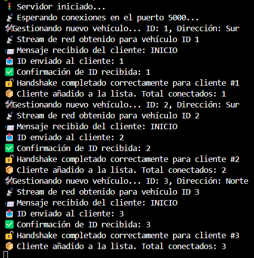

### 🖥️ Cliente: conectándose y confirmando ID

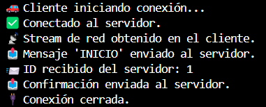

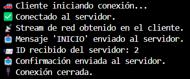

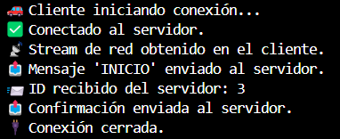

---

## 📁 Estructura del proyecto

- `Servidor/` – Código principal del servidor, conexiones, hilos, lógica de red
- `Cliente/` – Lógica del vehículo, conexión y comunicación con el servidor
- `NetworkStreamClass/` – Clase con métodos comunes para enviar y recibir mensajes (NS)
- `Vehiculo/` – Clases que representan vehículos, sus propiedades y comportamiento
- `Carretera/` – Clases que representan la carretera, posiciones, etc.

---

## 🧠 Observaciones

- Proyecto desarrollado en C# con .NET 8.0
- Pensado para ejecutarse desde consola


---

# ICB0009-UF3-PR01 – Intercambio de información entre vehículos 🚗📡

En esta segunda fase se implementa la simulación del movimiento de los vehículos y el intercambio continuo de información entre cliente y servidor.

---

## ✅ Etapas completadas

### 1️⃣ Métodos de serialización/deserialización
- Añadidos métodos `CarreteraABytes()` / `BytesACarretera()` y `VehiculoaBytes()` / `BytesAVehiculo()` en las clases `Carretera` y `Vehiculo`.
- Se utilizan en `NetworkStreamClass` para enviar/recibir objetos por red.

### 2️⃣ Creación y envío del vehículo
- Cada cliente crea un objeto `Vehiculo` con ID, velocidad y estado inicial.
- Lo envía al servidor tras el handshake.

### 3️⃣ Movimiento del vehículo
- El cliente simula el avance (posición de 0 a 100).
- Envía su estado en cada iteración (`Pos`, `Acabado`) con un `Thread.Sleep` según la `Velocidad`.

### 4️⃣ Envío del estado de la carretera a todos los clientes
- El servidor actualiza la lista de vehículos y reenvía el objeto `Carretera` completo a todos los clientes cada vez que cambia algún vehículo.

### 5️⃣ Recepción del estado en cliente (escucha activa)
- Cada cliente escucha en un hilo secundario.
- Muestra en consola la posición y estado de todos los vehículos de la carretera en tiempo real.
- Cuando finaliza su recorrido, envía un mensaje `"FIN"` y se desconecta limpiamente.
- Si se desconecta de forma incorrecta, el servidor lo detecta y lo elimina de la lista sin bloquearse.

---

## 💻 Nuevas capturas (Ejercicio 2)

### Simulación de vehículos en movimiento

### 🖥️ Servidor:


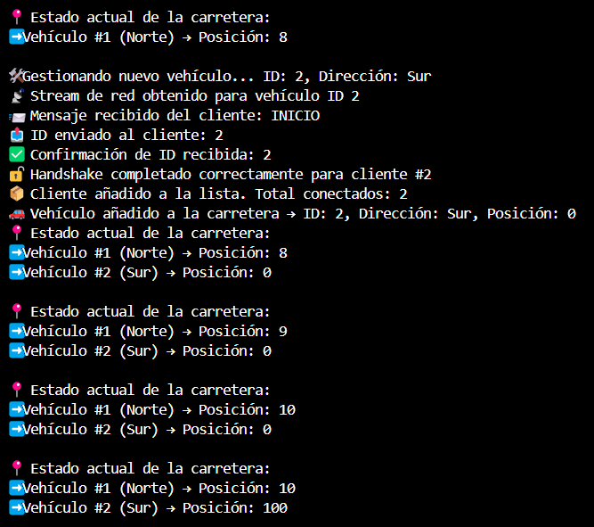

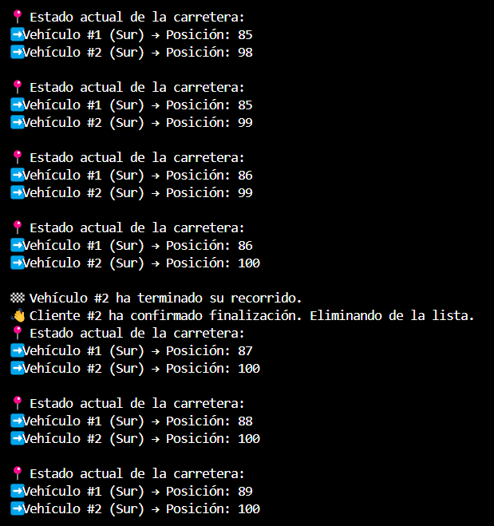

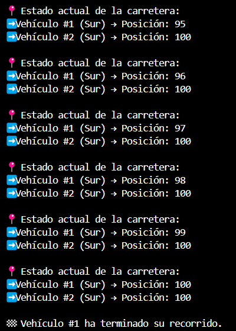

### 🖥️ Cliente:

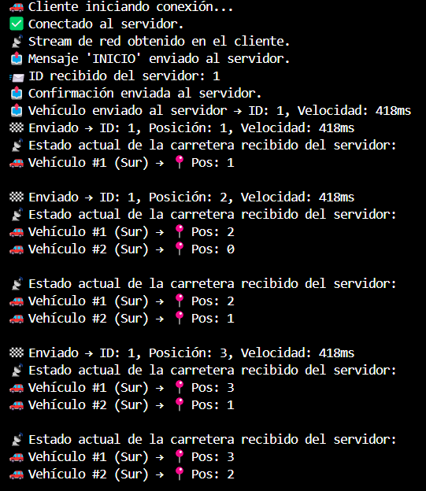

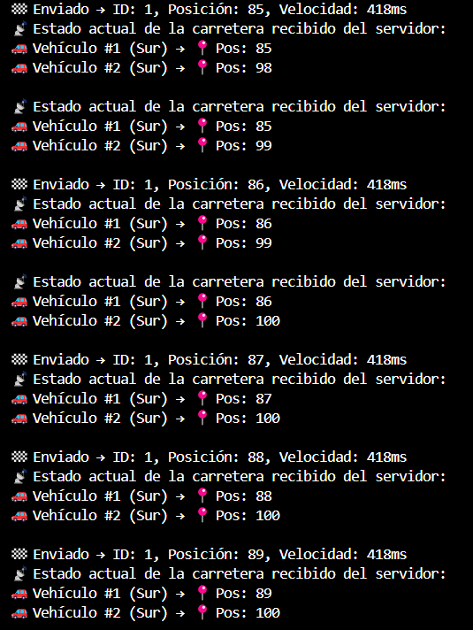

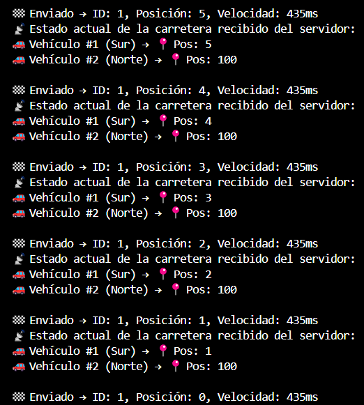

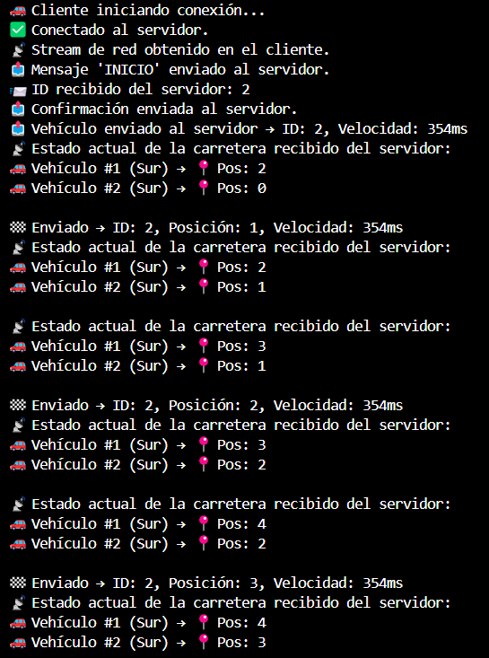

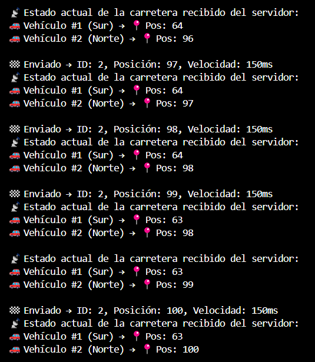

---

### ⚙️ Simulación de avance según dirección

- Cada vehículo recibe del servidor una dirección (`"Norte"` o `"Sur"`).
- En función de esta dirección:
  - Si es **"Norte"**, el vehículo avanza de **0 a 100 km**.
  - Si es **"Sur"**, el vehículo avanza de **100 a 0 km**.
- Esta lógica está implementada en el cliente, que ajusta su bucle de avance en base al valor del atributo `Direccion`.

---


# ICB0009-UF3-PR01 – Proyecto Cliente-Servidor de Vehículos 🚗📡

---

## ✅ Etapas completadas

---

## 🚦 Ejercicio 3️⃣: Control de tráfico en el puente

### Objetivo
- Permitir **solo un vehículo cruzando el puente a la vez**.
- Vehículos en dirección opuesta deben **esperar si el puente está ocupado**.

### Implementación
- **La lógica de control de acceso al puente se ha implementado en el servidor**:
  - Variable `VehiculoEnPuente` protege qué vehículo está cruzando.
  - Cuando un vehículo llega al inicio del puente (km 30 o 50):
    - Si no hay nadie en el puente, puede cruzar.
    - Si hay otro vehículo, debe esperar hasta que el puente quede libre.
- El servidor avisa cuando un vehículo entra o sale del puente.

### Ejemplo de flujo:
```
🚗 Vehículo #1 (Norte) llega al km 30 ➔ Entra al puente ➔ VehiculoEnPuente = #1
🚗 Vehículo #2 (Sur) llega al km 50 ➔ Espera ➔ Puente ocupado por #1
🚗 Vehículo #1 avanza ➔ km 50 ➔ Sale del puente ➔ VehiculoEnPuente = null
🚗 Vehículo #2 (Sur) puede entrar ahora
```

---

## 💻 Nuevas capturas (Ejercicio 3)

### 🖥️ Servidor:

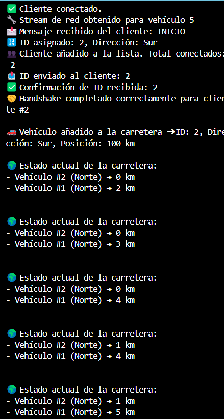

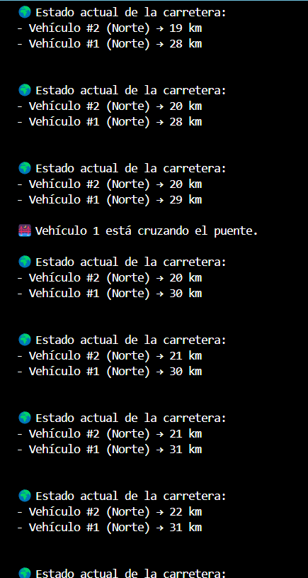

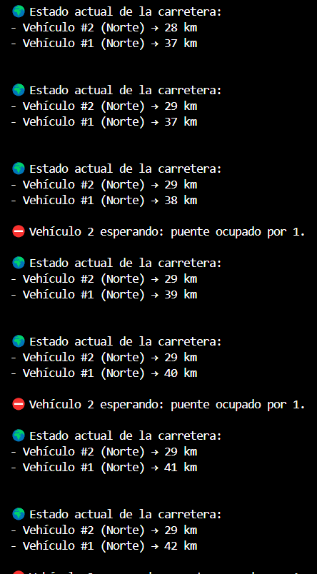

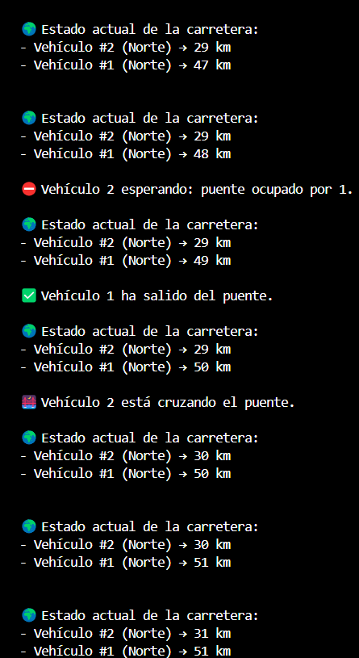

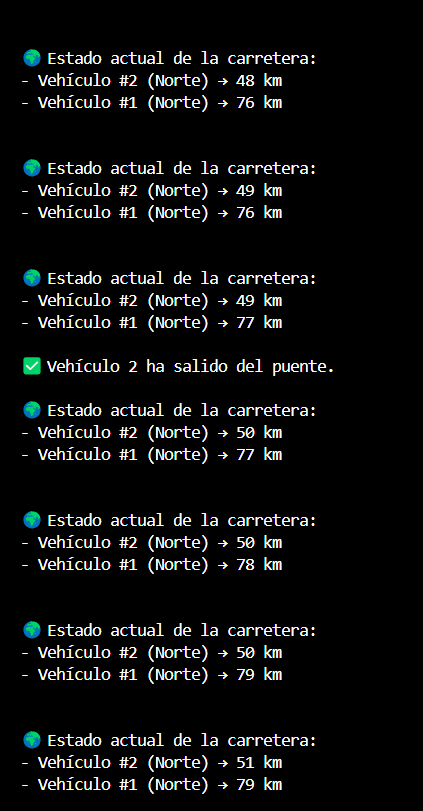

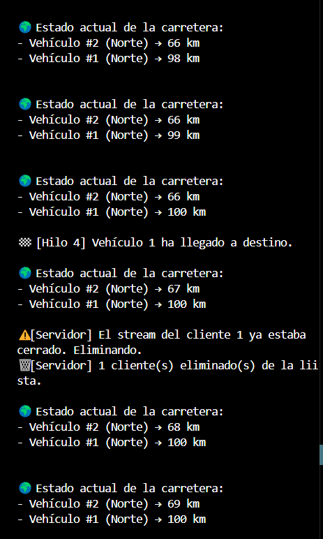

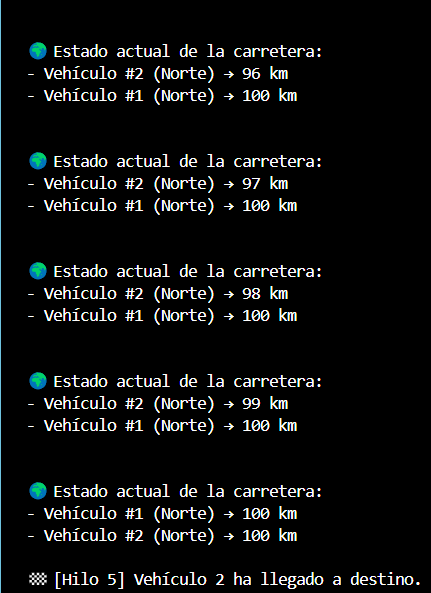

### 🖥️ Cliente:


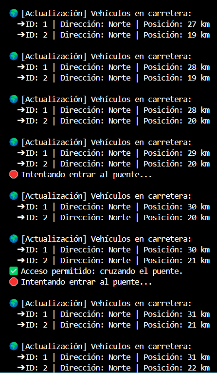

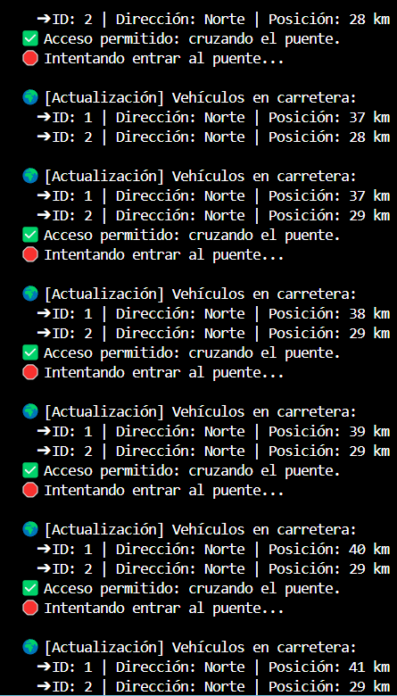

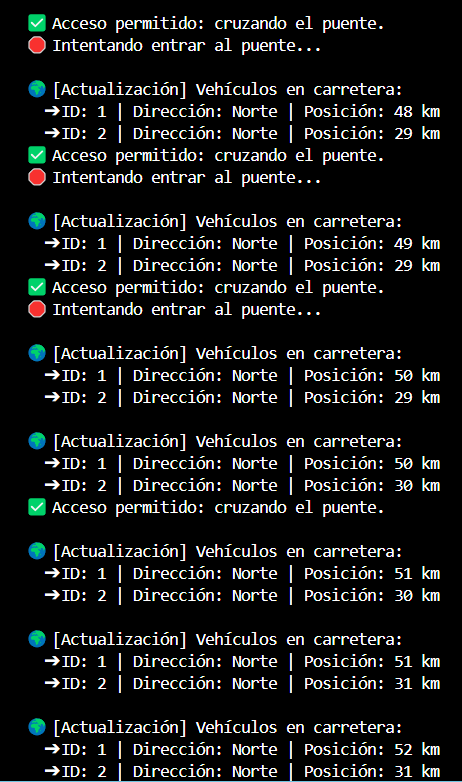

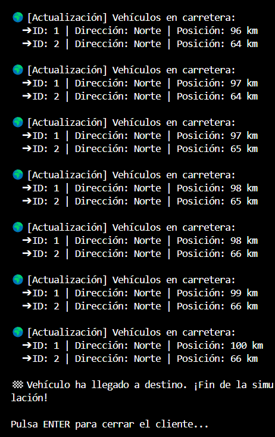

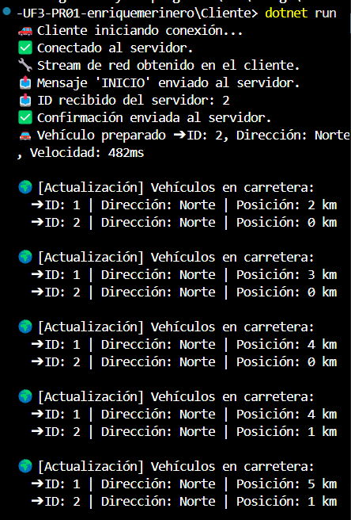

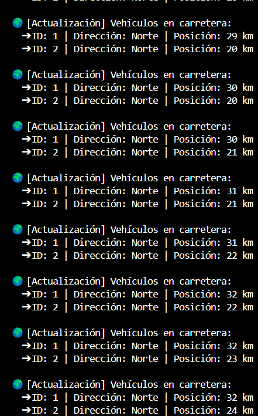

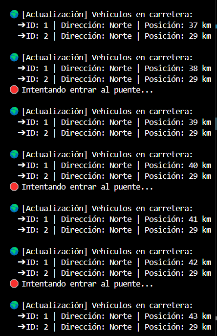

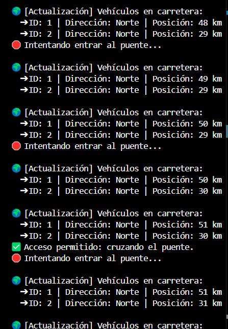

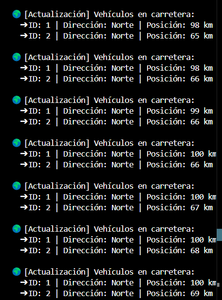

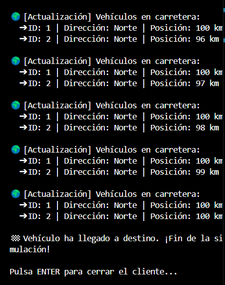

---

# 🧠 Preguntas del Ejercicio 3:

### ✏️ Pregunta 1: Explica las ventajas e inconvenientes de programar el control de paso por el túnel, en el cliente o en el servidor.

#### Respuesta:

**Se puede programar el control en el cliente o en el servidor. A continuación se detallan ventajas e inconvenientes de ambas opciones:**

---

#### 🖥️ Control en el Servidor

**Ventajas:**
- ✅ **Consistencia global:** Todos los clientes siguen las mismas reglas, ya que el servidor centraliza el control.
- ✅ **Mayor seguridad:** Los clientes no pueden "hacer trampas" ni saltarse las normas.
- ✅ **Facilidad de mantenimiento:** Cualquier cambio en la lógica se hace solo en el servidor, no en todos los clientes.
- ✅ **Gestión de errores:** Si un cliente se desconecta de forma inesperada, el servidor puede liberar automáticamente el puente.

**Inconvenientes:**
- ⚠️ **Mayor carga de procesamiento:** El servidor tiene que gestionar más lógica y puede saturarse si hay muchos vehículos.
- ⚠️ **Ligero aumento del tráfico de red:** Cada vez que un vehículo quiere cruzar, necesita comunicarse con el servidor.

---

#### 📱 Control en el Cliente

**Ventajas:**
- ✅ **Distribución de la carga:** Los clientes se encargan de gestionar sus propios movimientos, aligerando el trabajo del servidor.
- ✅ **Respuesta más rápida localmente:** El cliente decide sin necesidad de esperar la respuesta del servidor.

**Inconvenientes:**
- ⚠️ **Inconsistencias:** Sin un control central, podrían ocurrir errores donde dos vehículos cruzan al mismo tiempo.
- ⚠️ **Mayor complejidad en el cliente:** Cada cliente tendría que implementar la lógica completa de cruce y sincronización con otros clientes.
- ⚠️ **Mayor riesgo de trampas o errores:** Un cliente mal programado (o modificado) podría ignorar las reglas y generar conflictos.

---

#### 🏁 Conclusión:

👉 **Se ha decidido implementar el control de paso en el servidor.**  
De esta manera garantizamos **un comportamiento consistente, seguro y sincronizado para todos los vehículos**, a costa de un pequeño aumento de trabajo en el servidor, que es perfectamente asumible en este tipo de simulación.

---

### ✏️ Pregunta 2: ¿Cómo gestionar colas de espera para cruzar el puente?

#### Respuesta:

Para gestionar correctamente las colas de vehículos que esperan para cruzar el puente, propongo el siguiente diseño:

---

#### 🛠️ ¿Qué estructura de datos usaría?

- **Dos colas (`Queue`) separadas**, una para cada dirección:
  - `colaNorte` → Vehículos que van de Sur a Norte.
  - `colaSur` → Vehículos que van de Norte a Sur.

Cada cola mantendría el orden de llegada de los vehículos que quieren cruzar, **respetando la prioridad de los que llegaron antes** (principio FIFO: "First In, First Out").

---

#### 🔄 ¿Cómo sería la lógica de gestión?

- El servidor mantiene una **variable `vehiculoEnPuente`** para saber qué vehículo está cruzando en cada momento.
- Cuando un vehículo llega al inicio del puente (km 30 o 50), el servidor:
  - Si el puente está libre (`vehiculoEnPuente == null`):
    - Deja pasar al primer vehículo en la cola de su dirección (si existe).
    - Si no hay cola, pasa el vehículo que llegó al puente directamente.
  - Si el puente está ocupado:
    - Añade el vehículo a su cola correspondiente (`colaNorte` o `colaSur`).

- Cuando un vehículo **sale** del puente:
  - El servidor mira qué cola tiene vehículos esperando.
  - Da prioridad primero a vehículos de la **misma dirección** que el último que cruzó (si existen).
  - Si no hay vehículos en esa dirección, da paso a los vehículos en sentido contrario.

---

#### 📡 ¿Qué mostraría el cliente?

- Si el servidor indica que el vehículo está esperando ➔ Mostraría en pantalla:
  - `"Esperando (norte)"` o `"Esperando (sur)"`.
- Si el servidor indica que puede cruzar ➔ Mostraría:
  - `"Cruzando puente"`.

De esta manera, los clientes siempre sabrán su estado actualizado en función de la respuesta que reciban del servidor.

---

#### 🧠 Justificación de la elección:

- **Las colas (`Queue`)** son la mejor estructura porque:
  - Son fáciles de usar y rápidas de gestionar.
  - Respetan el orden de llegada de los vehículos.
  - Permiten un control limpio y justo de quién debe cruzar primero.
- Separarlas por dirección facilita que la gestión de prioridades sea simple y eficiente, evitando bloqueos innecesarios entre sentidos opuestos.

---

#### 🏁 Conclusión:

👉 Usar **dos colas separadas** para norte y sur, gestionadas desde el servidor, es una solución segura, ordenada y fácil de mantener para garantizar el cruce correcto de los vehículos por el puente.

---

**Sin embargo, en mi proyecto he optado por hacerlo de una forma más sencilla:**
Actualmente no utilizo colas separadas en el servidor.
En su lugar, cada vehículo simplemente comprueba si el puente está libre en el momento de llegar:
- Si está libre, cruza.
- Si está ocupado, espera y reintenta.
Esta aproximación es más simple, suficiente para garantizar el paso único de vehículos, y evita la complejidad de gestionar varias colas en memoria.

---

# 📋 Observaciones finales
- Proyecto desarrollado en C# utilizando .NET 8.0.
- Totalmente funcional y probado con múltiples clientes conectados simultáneamente.
- Interfaz de consola mejorada con emojis y mensajes claros para facilitar la comprensión del estado del sistema.
- Manejo correcto de desconexiones inesperadas de clientes.
- Comunicación fluida usando `NetworkStream` con prefijos de longitud y serialización XML para objetos.
- Implementación de hilos independientes para:
  - Movimiento del vehículo (hilo principal).
  - Recepción de actualizaciones de la carretera (hilo de escucha).
- Control de tráfico en el puente implementado en el servidor, garantizando que **solo un vehículo cruce a la vez**.
- Simulación de avance de vehículos respetando su dirección ("Norte" o "Sur") y gestionando correctamente su llegada al destino (`0 km` o `100 km`).