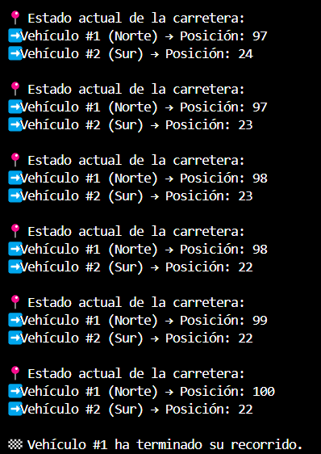
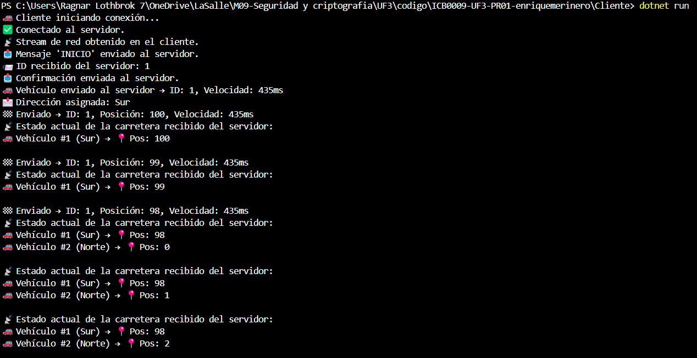

###
###
###


# ICB0009-UF3-PR01 – Ejercicio 1: Conexión de clientes 🚗📡

Este proyecto simula un sistema cliente-servidor para gestionar vehículos que circulan por una carretera con un puente de un solo carril. Los vehículos (clientes) se conectan al servidor para obtener un ID único y una dirección asignada.

---

## ✅ Etapas completadas

### 1️⃣ Conexión servidor - cliente
- El servidor acepta conexiones TCP desde varios clientes.

### 2️⃣ Aceptación concurrente de clientes
- Cada cliente se gestiona en un hilo diferente.

### 3️⃣ Asignación de ID y dirección
- Cada cliente recibe un ID único y una dirección aleatoria (Norte/Sur).

### 4️⃣ Obtención del NetworkStream
- Cliente y servidor obtienen el stream para intercambiar información.

### 5️⃣ Métodos de envío y recepción
- Implementados `LeerMensajeNetworkStream()` y `EscribirMensajeNetworkStream()` en `NetworkStreamClass.cs`.

### 6️⃣ Handshake
- Cliente: “INICIO” → Servidor responde con ID → Cliente confirma ID.

### 7️⃣ Almacenamiento de clientes
- Los clientes se almacenan en una lista con su ID y stream.

---

## 💻 Capturas de pantalla

### 🖥️ Servidor: mostrando conexiones y handshake


### 🖥️ Cliente: conectándose y confirmando ID


---

## 📁 Estructura del proyecto

- `Servidor/` – Código principal del servidor, conexiones, hilos, lógica de red
- `Cliente/` – Lógica del vehículo, conexión y comunicación con el servidor
- `NetworkStreamClass/` – Clase con métodos comunes para enviar y recibir mensajes (NS)
- `Vehiculo/` – Clases que representan vehículos, sus propiedades y comportamiento
- `Carretera/` – Clases que representan la carretera, posiciones, etc.

---

## 🧠 Observaciones

- Proyecto desarrollado en C# con .NET 8.0
- Pensado para ejecutarse desde consola


---

# ICB0009-UF3-PR01 – Intercambio de información entre vehículos 🚗📡

En esta segunda fase se implementa la simulación del movimiento de los vehículos y el intercambio continuo de información entre cliente y servidor.

---

## ✅ Etapas completadas

### 1️⃣ Métodos de serialización/deserialización
- Añadidos métodos `CarreteraABytes()` / `BytesACarretera()` y `VehiculoaBytes()` / `BytesAVehiculo()` en las clases `Carretera` y `Vehiculo`.
- Se utilizan en `NetworkStreamClass` para enviar/recibir objetos por red.

### 2️⃣ Creación y envío del vehículo
- Cada cliente crea un objeto `Vehiculo` con ID, velocidad y estado inicial.
- Lo envía al servidor tras el handshake.

### 3️⃣ Movimiento del vehículo
- El cliente simula el avance (posición de 0 a 100).
- Envía su estado en cada iteración (`Pos`, `Acabado`) con un `Thread.Sleep` según la `Velocidad`.

### 4️⃣ Envío del estado de la carretera a todos los clientes
- El servidor actualiza la lista de vehículos y reenvía el objeto `Carretera` completo a todos los clientes cada vez que cambia algún vehículo.

### 5️⃣ Recepción del estado en cliente (escucha activa)
- Cada cliente escucha en un hilo secundario.
- Muestra en consola la posición y estado de todos los vehículos de la carretera en tiempo real.
- Cuando finaliza su recorrido, envía un mensaje `"FIN"` y se desconecta limpiamente.
- Si se desconecta de forma incorrecta, el servidor lo detecta y lo elimina de la lista sin bloquearse.

---

## 💻 Nuevas capturas (Ejercicio 2)

### Simulación de vehículos en movimiento

### 🖥️ Servidor:





### 🖥️ Cliente:




---

### ⚙️ Simulación de avance según dirección

- Cada vehículo recibe del servidor una dirección (`"Norte"` o `"Sur"`).
- En función de esta dirección:
  - Si es **"Norte"**, el vehículo avanza de **0 a 100 km**.
  - Si es **"Sur"**, el vehículo avanza de **100 a 0 km**.
- Esta lógica está implementada en el cliente, que ajusta su bucle de avance en base al valor del atributo `Direccion`.

---


# ICB0009-UF3-PR01 – Proyecto Cliente-Servidor de Vehículos 🚗📡

---

## ✅ Etapas completadas

---

## 🚦 Ejercicio 3️⃣: Control de tráfico en el puente

### Objetivo
- Permitir **solo un vehículo cruzando el puente a la vez**.
- Vehículos en dirección opuesta deben **esperar si el puente está ocupado**.

### Implementación
- **La lógica de control de acceso al puente se ha implementado en el servidor**:
  - Variable `VehiculoEnPuente` protege qué vehículo está cruzando.
  - Cuando un vehículo llega al inicio del puente (km 30 o 50):
    - Si no hay nadie en el puente, puede cruzar.
    - Si hay otro vehículo, debe esperar hasta que el puente quede libre.
- El servidor avisa cuando un vehículo entra o sale del puente.

### Ejemplo de flujo:
```
🚗 Vehículo #1 (Norte) llega al km 30 ➔ Entra al puente ➔ VehiculoEnPuente = #1
🚗 Vehículo #2 (Sur) llega al km 50 ➔ Espera ➔ Puente ocupado por #1
🚗 Vehículo #1 avanza ➔ km 50 ➔ Sale del puente ➔ VehiculoEnPuente = null
🚗 Vehículo #2 (Sur) puede entrar ahora
```

---

## 💻 Nuevas capturas (Ejercicio 3)

### 🖥️ Servidor:


### 🖥️ Cliente:


---

# 🧠 Preguntas del Ejercicio 3:

✏️ **Pregunta 1:** ¿En qué parte del sistema hemos decidido implementar el control de acceso al puente? ¿Por qué?

✏️ **Pregunta 2:** ¿Qué problemas o situaciones podría provocar que no controlásemos el acceso al puente correctamente?

---

# 📋 Observaciones finales
- Proyecto desarrollado en C# utilizando .NET 8.0.
- Totalmente funcional.
- Interfaz de consola mejorada con emojis y mensajes claros.
- Manejo correcto de desconexiones de clientes.
- Comunicación fluida usando `NetworkStream` con prefijos de longitud y serialización XML.